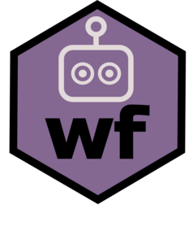

<!-- README.md is generated from README.Rmd. Please edit that file -->

# wf <a href="https://christopherkenny.github.io/wf/"></a>

<!-- badges: start -->

[](https://github.com/christopherkenny/wf/actions/workflows/R-CMD-check.yaml)
<!-- badges: end -->

`wf` manages skills for AI coding agents. Skills are reusable
instruction sets that extend what an agent can do. They live in a
conventional directory for each agent (e.g., `.claude/skills/` for
Claude Code) and can be installed from GitHub or a local path.

## Installation

``` r
# install.packages('pak')
pak::pak('christopherkenny/wf')
```

## Setup

Set `WF_AGENT` in your `.Renviron` so every `wf` function knows which
agent you use:

``` r
usethis::edit_r_environ()
```

Add a line like:

``` r
WF_AGENT='claude_code'
```

Supported agents: `'claude_code'` (alias: `'claude'`), `'openclaw'`,
`'codex'`, `'cursor'`, `'gemini_cli'`, `'github_copilot'`.

Skills can be scoped to a project (`.agent/skills/`) or installed
globally (`~/.agent/skills/`):

``` r
library(wf)

skill_path('claude_code', 'project') # project-local
#> [1] ".claude/skills"
skill_path('claude_code', 'global') # user-global
#> [1] "~/.claude/skills"
skill_path() # auto-detected from WF_AGENT or directory
#> [1] ".claude/skills"
```

## Example

Install a skill from GitHub using its `owner/repo` shorthand or a full
URL:

``` r
add_skill('some-user/some-skill')
```

For repos that bundle multiple skills, use the `skill` argument:

``` r
add_skill('some-user/skills', skill = 'proofread')
```

List, check, and update installed skills:

``` r
list_skills()
#>                                                           name
#> .claude/skills/tidy-argument-checking              types-check
#> .claude/skills/tidy-deprecate-function tidy-deprecate-function
#>                                                                                                                                                                                                                                                             description
#> .claude/skills/tidy-argument-checking  Validate function inputs in R using a standalone file of check_* functions. Use when writing exported R functions that need input validation, reviewing existing validation code, or when creating new input validation helpers.
#> .claude/skills/tidy-deprecate-function                    Guide for deprecating R functions/arguments. Use when a user asks to deprecate a function or parameter, including adding lifecycle warnings, updating documentation, adding NEWS entries, and updating tests.
#>                                        source installed_at
#> .claude/skills/tidy-argument-checking    <NA>         <NA>
#> .claude/skills/tidy-deprecate-function   <NA>         <NA>
check_skills()
#> [1] name             installed_sha    latest_sha       update_available
#> <0 rows> (or 0-length row.names)
update_skills()
#> All skills are up to date.
```

## Finding and creating skills

Search GitHub for community skills tagged with `claude-skill`:

``` r
find_skill()               # all skills
find_skill('quarto')   # filtered by keyword
```

Scaffold a new skill with a template `SKILL.md`:

``` r
tmp <- tempfile()
init_skill('my-skill', tmp)
#> Created skill "my-skill" at
#> 'C:/Users/chris/AppData/Local/Temp/RtmpwnuOag/file618c77657df2/my-skill'.
```
